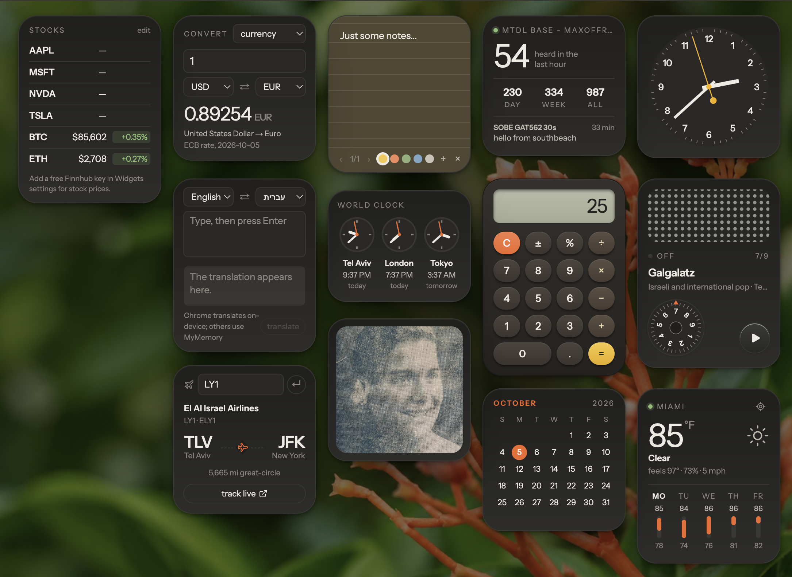

<p align="center">
  
</p>
<p align="center">
  <a href="https://github.com/glzr-io/zebar">
    
  </a>
  
  <a href="https://opensource.org/licenses/MIT">
    
  </a>
</p>

# 🧩 Widgets Pack

Thirteen Braun-inspired desktop widgets for [**Zebar**](https://github.com/glzr-io/zebar), on **Windows, macOS, and Linux**. Warm white plastic in light mode, graphite in dark mode, with an orange accent. See them live on [maxhayim.com](https://maxhayim.com).

This repository contains:
- **zpack.json** — the Zebar widget pack: all 13 widgets, their window options, default placement, and allowed programs
- **dist/** — the built widgets Zebar runs (included, so there's nothing to build)
- **widgets/** and **src/** — the source: React 19 and Tailwind 4, built with Vite
- **docs/** — the developer guide and the screenshot

---

## The widgets

| Widget | What it does | Data from |
| --- | --- | --- |
| **Clock** | Wall clock after the Braun ABW 41, any time zone | this computer |
| **World Clock** | Three cities at a glance | this computer |
| **Calendar** | This month, in your language | this computer |
| **Weather** | Now and five days ahead; any city, or near you | [Open-Meteo](https://open-meteo.com/) |
| **Radio** | Nine stations on a tuning wheel, after the Braun T3 | the stations' own streams |
| **Calculator** | After the Braun ET66; works with the keyboard | this computer |
| **Sticky Notes** | Notes in five colors that save as you type | this computer |
| **Convert** | Units and currencies | [Frankfurter](https://frankfurter.dev/) (ECB rates) |
| **Translator** | Eleven languages | [MyMemory](https://mymemory.translated.net/) |
| **Flight Tracker** | A flight's airline and route, with a live map link | [adsbdb](https://www.adsbdb.com/) |
| **Stocks** | Up to 8 symbols; crypto without a key | CoinGecko, [Finnhub](https://finnhub.io/) (free key) |
| **Mesh** | Your mesh, live from your own [MeshMonitor](https://github.com/Yeraze/MeshMonitor) | your MeshMonitor |
| **Photo Gallery** | Your photos in a frame, with a large view | this computer |

Design goals:
- One look across every widget, in light and dark
- Free data sources only; no accounts needed except an optional Finnhub key
- Settings, notes, and photos stay on your computer
- Nothing to build or install beyond Zebar

---

## Installing

1. Install [Zebar](https://github.com/glzr-io/zebar/releases) (free).
2. Put the pack in Zebar's folder, `~/.glzr/zebar/` (on Windows, `%USERPROFILE%\.glzr\zebar\`). Either:
   - download `widgets-pack-<version>.zip` from the [latest release](https://github.com/maxhayim/widgets-pack/releases/latest) and unzip it there, or
   - clone it:
     ```
     git clone https://github.com/maxhayim/widgets-pack ~/.glzr/zebar/widgets-pack
     ```
3. Restart Zebar. From its tray icon, open **Widget packs → widgets-pack** and turn on the widgets you want. Choose **Run on startup** to keep them.

### Updating

Download the new release ZIP over the old folder, or run `git pull` in `~/.glzr/zebar/widgets-pack`. Then restart Zebar.

---

## Using them

- **Move:** drag a widget anywhere. It snaps to a 16px grid, stays fully on screen, and comes back to the same spot next time (remembered per monitor setup).
- **Settings:** right-click a widget, or click it and use the gear in its bottom-left corner. Each widget has its own settings, plus ones shared by all of them: language, 12 or 24 hours, °F or °C, and light, dark, or automatic.
- **Layer:** in settings, choose whether a widget sits below other windows, normally, or always on top.
- **Links** (station sites, live flight maps) open in your default browser.

### Mesh

In MeshMonitor, create an API token (a read-only user is plenty) and add `http://127.0.0.1:6124` to `ALLOWED_ORIGINS`. That's the address Zebar serves widgets from. Then enter the address and token in the Mesh widget's settings.

### Stocks

Crypto (BTC, ETH, SOL…) works without a key. For stock prices, get a [free Finnhub key](https://finnhub.io/register) and add it in the Stocks widget's settings.

---

## Privacy

- Settings, notes, and photos are kept in Zebar's storage for this pack, on this computer. Nothing is uploaded.
- The Finnhub key and MeshMonitor token are kept there too, in plain storage rather than the system keychain. Use a read-only MeshMonitor token.
- The weather's "near me" uses your internet address for a city-level location. It's off until you press the locate button.
- Widgets can run only `open`, `xdg-open`, or `explorer`, and only with a single https link, to open pages in your browser.

---

## Repository layout

```
zpack.json            the 13 widgets for Zebar
dist/                 the built widgets (committed)
widgets/<name>/       one widget: index.html + main.jsx
src/shared/           the frame, settings storage, time helpers, and the look
docs/GUIDE.md         developer guide
docs/assets/          screenshot
```

---

## Changing them

Needs [Node.js](https://nodejs.org/). See [docs/GUIDE.md](docs/GUIDE.md).

```
npm install
npm run build     # or: npm run dev, to rebuild on every save
```

Then restart Zebar. Commit `dist/` along with your changes, since Zebar runs the built files.

---

## Versioning

This project follows semantic versioning.

- **v1.1.0** — screenshot, release downloads, contributing, code of conduct, and security policy
- **v1.0.1** — fixes found running inside Zebar: text sizes, drop-downs, and the settings gear
- **v1.0.0** — the thirteen widgets as a Zebar widget pack

See [CHANGELOG.md](CHANGELOG.md) for details.

---

## License

This project is licensed under the MIT License.

See the [LICENSE](LICENSE) file for details.  
Full license text: https://opensource.org/licenses/MIT

---

## Contributing

Pull requests are welcome. Open an issue first to discuss ideas or report bugs. See [CONTRIBUTING.md](CONTRIBUTING.md).

---

## Acknowledgments

* [Zebar](https://github.com/glzr-io/zebar) by glzr.io
* MeshMonitor built by [Yeraze](https://github.com/Yeraze)
* Design after Dieter Rams and Dietrich Lubs's work at Braun
* Data from Open-Meteo, Frankfurter, MyMemory, adsbdb, CoinGecko, and Finnhub
